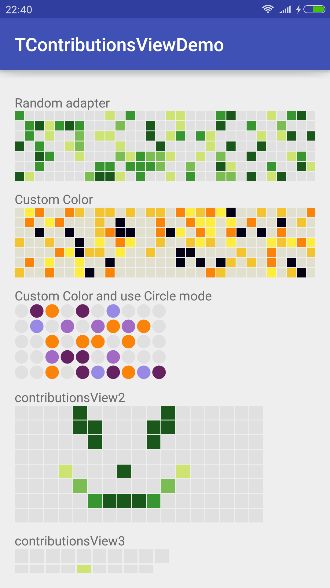
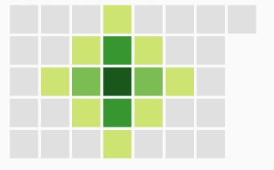
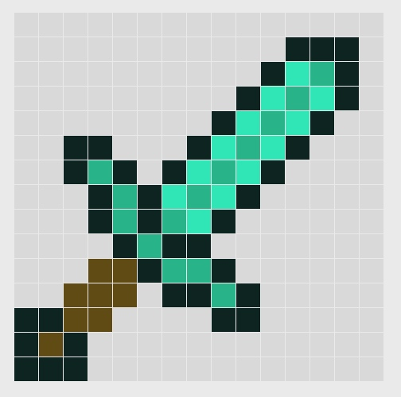
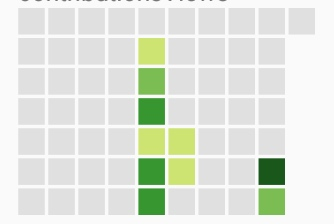
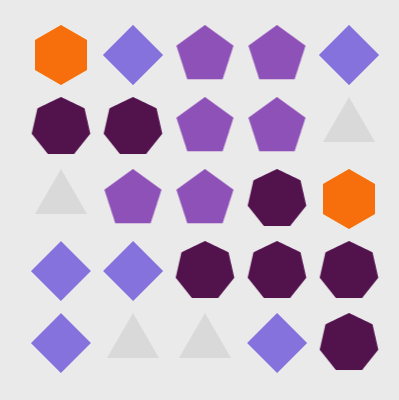

**[【English Version Click Here】](./README.md)**

TContributionsView可以用以显示类似github贡献度的View，当然，也绝不仅限于此~

> 👻一开始，我只是想用它来显示 Github 贡献图，所以才给它起名字叫TContributionsView，后来，我发现它似乎还有很多更有意思的玩法……
目前想到的可以发展的应用场景有： github 贡献图、像素画、电影院选座？棋盘？……

# 1. 效果图


# 2. 快速开始：

**引入：**

```java
compile 'com.barryzhang:tcontributionsview:0.2'
``` 
 
想显示这样：  
  
只需要这么写：

```java
IntArraysContributionsViewAdapter adapter = new IntArraysContributionsViewAdapter();
Integer arrays[][] = {
        {0, 0, 0, 1, 0, 0, 0, 0},
        {0, 0, 1, 3, 1, 0, 0},
        {0, 1, 2, 4, 2, 1, 0},
        {0, 0, 1, 3, 1, 0, 0},
        {0, 0, 0, 1, 0, 0, 0},
};
adapter.setArrays(arrays);
contributionsView.setAdapter(adapter);
```
😀是不是超简单？

# 3. 属性&Level说明

  
每个格子都是用一个int值来表示它的Level属性。目前支持0-4五个Level的格子、以及一个用-1表示的空状态。 
只需给不同的格子设置不同的Level，即可控制它的显示。

在xml中设置颜色、尺寸、是否显示圆形等：
```xml
<com.barryzhang.tcontributionsview.TContributionsView
    android:id="@+id/contributionsView1s"
    android:layout_width="wrap_content"
    android:layout_height="wrap_content"
    
    app:contributions_use_circle="true"
    app:contributions_color_0="#E1DFCE"
    app:contributions_color_1="#FFED3B"
    app:contributions_color_2="#F4C42E"
    app:contributions_color_3="#FB8308"
    app:contributions_color_4="#040015"
    app:contributions_item_height="10dp"
    app:contributions_item_space="1dp"
    app:contributions_item_width="10dp"/>
```  

# 4. Adapter
使用setAdapter进行数据设置：

**基本用法:**
```java
BaseContributionsViewAdapter adapter;
// config adapter 
contributionsView.setAdapter(adapter);
```
已经内置了几种常用的Adapter，你也可以很方便地自定义自己的Adapter。 

**内置的几种Adapter**

* `PositionContributionsViewAdapter` ：基于(x,y)坐标
* `AbstractArraysContributionsViewAdapter`：使用一个二维数组进行标识，用起来特别方便
* `IntArraysContributionsViewAdapter`：继承AbstractArraysContributionsViewAdapter，使用int[][]表示数据
* `DateContributionsAdapter`：基于日期的表示，用这个Adapter可以很方便地实现类似github个人主页的贡献度图的效果
* `TestContributionAdapter`：一个随机level的adapter~ 一般用以演示 :-D


## 4.1 ArraysContributionsViewAdapter
前面的"快速开始"已经是一个例子，这个adapter其实还可以很方便地做一些其他的效果，比如这样：
```java
IntArraysContributionsViewAdapter adapter = new IntArraysContributionsViewAdapter();
Integer arrays[][] = {
        {0, 0, 0, 0, 0, 0, 0, 0, 0, 0, 0, 0, 0, 0, 0,},
        {0, 0, 0, 0, 0, 0, 0, 0, 0, 0, 0, 4, 4, 4, 0,},
        {0, 0, 0, 0, 0, 0, 0, 0, 0, 0, 4, 2, 3, 4, 0,},
        {0, 0, 0, 0, 0, 0, 0, 0, 0, 4, 2, 3, 2, 4, 0,},
        {0, 0, 0, 0, 0, 0, 0, 0, 4, 2, 3, 2, 4, 0, 0,},
        {0, 0, 4, 4, 0, 0, 0, 4, 2, 3, 2, 4, 0, 0, 0,},
        {0, 0, 4, 3, 4, 0, 4, 2, 3, 2, 4, 0, 0, 0, 0,},
        {0, 0, 0, 4, 3, 4, 2, 3, 2, 4, 0, 0, 0, 0, 0,},
        {0, 0, 0, 4, 3, 4, 3, 2, 4, 0, 0, 0, 0, 0, 0,},
        {0, 0, 0, 0, 4, 3, 4, 4, 0, 0, 0, 0, 0, 0, 0,},
        {0, 0, 0, 1, 1, 4, 3, 3, 4, 0, 0, 0, 0, 0, 0,},
        {0, 0, 1, 1, 1, 0, 4, 4, 3, 4, 0, 0, 0, 0, 0,},
        {4, 4, 1, 1, 0, 0, 0, 0, 4, 4, 0, 0, 0, 0, 0,},
        {4, 1, 4, 0, 0, 0, 0, 0, 0, 0, 0, 0, 0, 0, 0,},
        {4, 4, 4, 0, 0, 0, 0, 0, 0, 0, 0, 0, 0, 0, 0,},
};
adapter.setArrays(arrays);
contributionsView.setAdapter(adapter);
```

  
恭喜你获得成就：  
『出击时间到！』 😁

通过`AbstractArraysContributionsViewAdapter`，可以使用任意数据类型T表示等级，只需要重写它的`int mapLevel(T from)`方法即可。

## 4.2 PositionContributionsViewAdapter

基于(x,y)坐标，给每个格子设置显示等级，未设置的格子默认为0.
例子：

```java
PositionContributionsViewAdapter adapter =
        new PositionContributionsViewAdapter(8, 17);
adapter.put(0, 4, 4);
adapter.put(1, 4, 4);
adapter.put(1, 5, 4);
adapter.put(2, 5, 4);
adapter.put(0, 10, 4);
adapter.put(1, 10, 4);
adapter.put(1, 9, 4);
adapter.put(2, 9, 4);
adapter.put(4, 7, 4);
adapter.put(4, 3, 1);
adapter.put(5, 4, 2);
adapter.put(6, 5, 3);
adapter.put(6, 6, 4);
adapter.put(6, 7, 4);
adapter.put(6, 8, 4);
adapter.put(6, 9, 3);
adapter.put(5, 10, 2);
adapter.put(4, 11, 1);
contributionsView.setAdapter(adapter);
```



## 4.3 DateContributionsAdapter
使用`DateContributionsAdapter`可以快速制作出类似github个人主页的贡献度显示效果。
这里的row被固定为7（一周）。
```java
DateContributionsAdapter adapter = new DateContributionsAdapter() ;
adapter.setWeekCount(10);
adapter.setEndDay("2016-11-20");
adapter.put("2016-10-17", 1);
adapter.put("2016-10-18", 2);
adapter.put("2016-10-19", 3);
adapter.put("2016-10-20", 4);
adapter.put("2016-10-21", 3);
adapter.put("2016-10-22", 3);
adapter.put("2016-10-27", 1);
adapter.put("2016-10-28", 1);
adapter.put("2016-10-20", 1);
adapter.put("2016-11-19", 2);
adapter.put("2016-11-18", 4);
contributionsView.setAdapter(adapter);
```


## 4.4 自定义Adapter

可以很方便地进行自定义Adapter，只需要继承BaseContributionsViewAdapter，然后重写其中几个方法即可。
```java
// 获取行数
public abstract int getRowCount();
// 获取列数
public abstract int getColumnCount();
// 获取指定行列所对应的level值（-1~4）
public abstract int getLevel(int row, int column);
```

内置的`TestContributionAdapter`是一个很简单的示例：
```java

public class TestContributionAdapter extends BaseContributionsViewAdapter {
    private int row;
    private int column;

    public TestContributionAdapter() { this(7,20); }

    public TestContributionAdapter(int row, int column) {
        super();
        this.row = row;
        this.column = column;
    }

    @Override
    public int getRowCount() { return this.row; }

    @Override
    public int getColumnCount() { return this.column; }

    @Override
    public int getLevel(int row, int column) {
        return (int) (Math.random() * 100) % 10;
    }
}
```


# 5. 自定义Item样式（Canvas）
[0.2版本添加]  
可以通过Canvas进行绘制自定义样式的格子，Demo：  
  

```java
TestContributionAdapter adapter = new TestContributionAdapter(5, 5);
adapter.setOnDrawItemListener(new TContributionsView.OnDrawItemListener() {
    // called before the default drawItem method
    @Override
    public boolean beforeDrawItem(RectF rect, Canvas canvas, Paint paintByLevel, int level) {
        // True will not called default drawItem method, false otherwise.
        return true;
    }
    //called after the default drawItem method
    @Override
    public void afterDrawItem(RectF rect, Canvas canvas, Paint paintByLevel, int level) {
        // Draw a Regular polygon inside the giving Rect area
        CanvasUtil.drawPolygon(rect,canvas,paintByLevel,level+3);
    }
});
contributionsView.setAdapter(adapter);
```

# 6. 更新记录

## V 0.2
添加自定义item样式的方法: `adapter.setOnDrawItemListener`

## V 0.1
基础功能

 
# 7. 关于作者
 "barryhappy2010#gmail.com".replace("#","@") 

***
# 8. License 

    Copyright 2016 Barry Zhang

    Licensed under the Apache License, Version 2.0 (the "License");
    you may not use this file except in compliance with the License.
    You may obtain a copy of the License at

       http://www.apache.org/licenses/LICENSE-2.0

    Unless required by applicable law or agreed to in writing, software
    distributed under the License is distributed on an "AS IS" BASIS,
    WITHOUT WARRANTIES OR CONDITIONS OF ANY KIND, either express or implied.
    See the License for the specific language governing permissions and
    limitations under the License.

